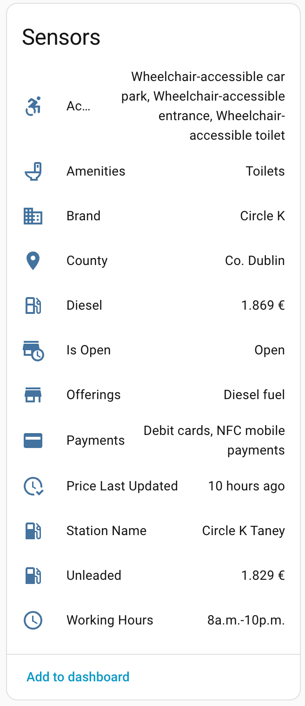

# FuelCompare.ie — Home Assistant Custom Integration

[](https://analytics.home-assistant.io)
[](https://github.com/italo-lombardi/Home-Assistant-FuelCompare/releases)
[](https://github.com/italo-lombardi/Home-Assistant-FuelCompare/actions/workflows/validate.yml)
[](LICENSE)

> **Disclaimer:** This is an independent, unofficial custom integration for Home Assistant. It is not affiliated with, endorsed by, or in any way connected to FuelCompare.ie or its owners. The FuelCompare.ie name and website are the property of their respective owners. This project simply reads publicly available data from their website for personal use.

---

## What this is

A [Home Assistant](https://www.home-assistant.io/) custom integration that tracks live fuel prices and station information for Irish petrol stations listed on [fuelcompare.ie](https://fuelcompare.ie). Each station you add creates a full set of sensors covering prices, opening hours, facilities, and real-time open/closed status.

## How it works

FuelCompare.ie is built with [Next.js](https://nextjs.org/). Next.js embeds a `buildId` in every HTML page and serves its page data as structured JSON at a predictable path:

```
https://fuelcompare.ie/_next/data/{buildId}/station/{stationId}.json
```

This integration:

1. Loads the station HTML page once to extract the current `buildId`.
2. Fetches the Next.js JSON endpoint for that station to get the full station record.
3. Parses prices, opening hours, facilities, and location from the JSON.
4. Repeats the fetch every **30 minutes** via Home Assistant's `DataUpdateCoordinator`.
5. If the `buildId` becomes stale (Next.js redeploys the site), it automatically re-fetches it before retrying.

No unofficial API keys, no scraping fragile HTML — just the same structured JSON the browser receives.

## Entities created



Each station creates **11 entities** grouped under a single device.

### Fuel price sensors

| Entity | Unit | Attributes |
|--------|------|------------|
| `sensor.<name>_unleaded` | € | `station_id`, `fuel_type`, `price_last_updated` |
| `sensor.<name>_diesel` | € | `station_id`, `fuel_type`, `price_last_updated` |

### Station info sensors

| Entity | State | Attributes |
|--------|-------|------------|
| `sensor.<name>_brand` | Chain name e.g. `Circle K` | — |
| `sensor.<name>_county` | County e.g. `Co. Dublin` | — |
| `sensor.<name>_working_hours` | Today's hours e.g. `6a.m.-10p.m.` | Full weekly schedule |
| `sensor.<name>_accessibility` | Active features e.g. `Wheelchair-accessible entrance` | Full category dict |
| `sensor.<name>_offerings` | Active offerings e.g. `Car wash, Diesel fuel` | Full category dict |
| `sensor.<name>_amenities` | Active amenities e.g. `Toilets` | Full category dict |
| `sensor.<name>_payments` | Accepted payments e.g. `Debit cards, NFC mobile payments` | Full category dict |

> Facility sensors (`accessibility`, `offerings`, `amenities`, `payments`) are marked unavailable if a station does not provide data for that category.

### Binary sensor

| Entity | State | Attributes |
|--------|-------|------------|
| `binary_sensor.<name>_is_open` | `on` = open, `off` = closed | `today_hours` |

The is-open state is derived by parsing today's working hours against the current time. Supports standard ranges (`6a.m.-10p.m.`), 24-hour stations, and closed days.

## Installation

### Via HACS (recommended)

1. Open HACS in Home Assistant.
2. Go to **Integrations** → three-dot menu → **Custom repositories**.
3. Add `https://github.com/italo-lombardi/Home-Assistant-FuelCompare` with category **Integration**.
4. Search for **FuelCompare.ie** and install it.
5. Restart Home Assistant.

### Manual

1. Copy the `custom_components/fuelcompare_ie` folder into your Home Assistant `config/custom_components/` directory.
2. Restart Home Assistant.

## Configuration

1. Go to **Settings → Devices & Services → Add Integration**.
2. Search for **FuelCompare.ie**.
3. Enter the **Station ID** — the number at the end of the station URL on fuelcompare.ie.
4. Optionally enter a friendly name (defaults to `Station <id>`).

### Finding a station ID

1. Go to [fuelcompare.ie](https://fuelcompare.ie) and search for your station.
2. Click the station — the URL will look like `https://fuelcompare.ie/station/790`.
3. The number at the end (`790` in this example) is the Station ID.

You can add as many stations as you like; each gets its own device entry.

## Requirements

- Home Assistant 2024.1.0 or newer
- Internet access from the Home Assistant host

## Disclaimer (repeated for clarity)

This project is a personal, community tool. It is **not** the official FuelCompare.ie app or service. The author has no relationship with FuelCompare.ie. If FuelCompare.ie changes their website structure this integration may stop working; please open an issue and it will be looked at when time allows.

## License

MIT — see [LICENSE](LICENSE).

## Issues & contributions

Bug reports and pull requests are welcome at [italo-lombardi/Home-Assistant-FuelCompare](https://github.com/italo-lombardi/Home-Assistant-FuelCompare/issues).
