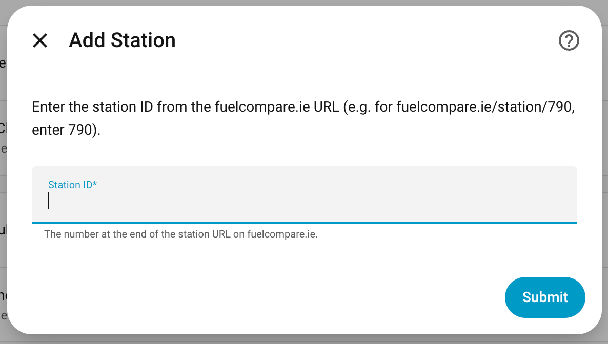
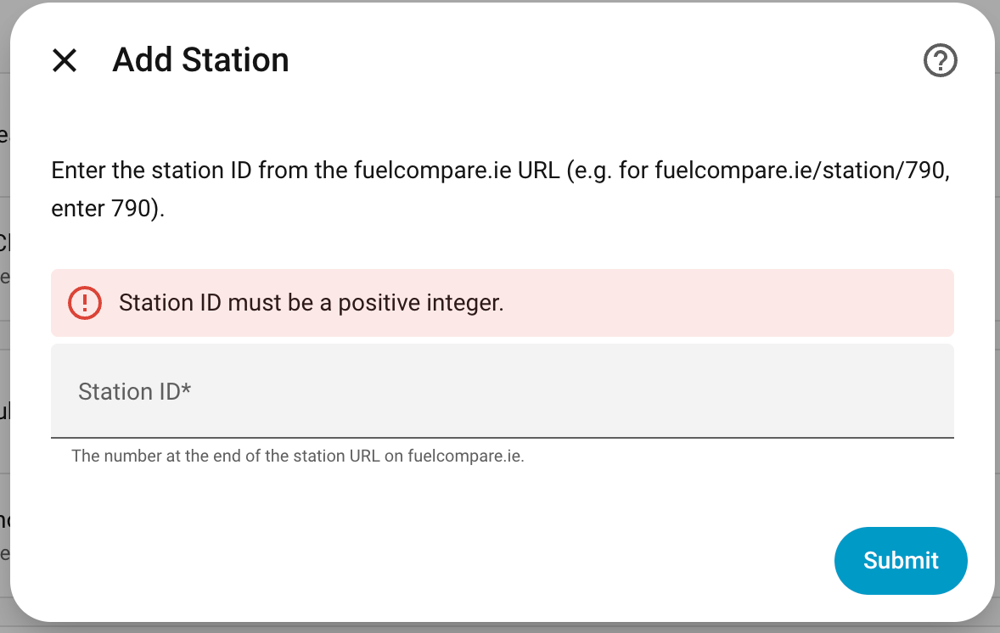
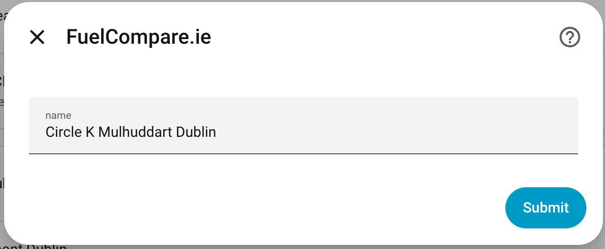

# FuelCompare.ie — Home Assistant Custom Integration

<a href="https://analytics.home-assistant.io"></a>
<a href="https://github.com/italo-lombardi/Home-Assistant-FuelCompare/releases"></a>
<a href="https://github.com/italo-lombardi/Home-Assistant-FuelCompare/actions/workflows/validate.yml"></a>
<a href="https://github.com/italo-lombardi/Home-Assistant-FuelCompare/blob/main/LICENSE"></a>


[](https://my.home-assistant.io/redirect/hacs_repository/?owner=italo-lombardi&repository=Home-Assistant-FuelCompare&category=integration)
[](https://my.home-assistant.io/redirect/config_flow_start/?domain=fuelcompare_ie)

> **Disclaimer:** This is an independent, unofficial custom integration for Home Assistant. It is not affiliated with, endorsed by, or in any way connected to FuelCompare.ie or its owners. The FuelCompare.ie name and website are the property of their respective owners. This project simply reads publicly available data from their website for personal use.

---

## What this is

A [Home Assistant](https://www.home-assistant.io/) custom integration that tracks live fuel prices and station information for Irish petrol stations listed on [fuelcompare.ie](https://fuelcompare.ie). Each station you add creates a full set of sensors covering prices, opening hours, facilities, and real-time open/closed status.

## How it works

FuelCompare.ie is built with [Next.js](https://nextjs.org/). The integration uses two data paths with automatic fallback:

**Primary path — Next.js static JSON**

Next.js embeds a `buildId` in every HTML page and serves page data as structured JSON at a predictable path:

```
https://fuelcompare.ie/_next/data/{buildId}/station/{stationId}.json
```

The integration extracts the `buildId` from the station HTML page and fetches that JSON directly. If the `buildId` becomes stale (site redeploys), it is refreshed automatically before retrying.

**Fallback path — encrypted POST API**

FuelCompare.ie migrated some stations (including stations not available via SSR) to a client-side API endpoint (`/fuelcompareback/stationbyid`). Responses from this endpoint are AES-encrypted using a key embedded in their JS bundle. The integration:

1. Extracts the decrypt key from the station JS chunk (same HTML fetch as the `buildId`).
2. Caches the key and reuses it across updates.
3. If decryption fails (site redeployed with a new key), automatically re-extracts the key and retries.

Both paths feed the same sensor pipeline — all entities are identical regardless of which path succeeds.

**Update cycle**

The integration repeats data fetch every **30 minutes** via Home Assistant's `DataUpdateCoordinator`. No unofficial API keys required.

## Entities created


Each station creates **15 entities** grouped under a single device.

### Fuel price sensors

| Entity | Unit | Attributes |
|--------|------|------------|
| `sensor.<name>_unleaded` | € | `station_id`, `fuel_type`, `source`, `price_last_updated` |
| `sensor.<name>_diesel` | € | `station_id`, `fuel_type`, `source`, `price_last_updated` |

### Station info sensors

| Entity | State | Attributes |
|--------|-------|------------|
| `sensor.<name>_price_last_updated` | Timestamp (UTC) of last price update on fuelcompare.ie | `station_id` |
| `sensor.<name>_station_name` | Full station name e.g. `Circle K Mulhuddart` | `station_id` |
| `sensor.<name>_brand` | Chain name e.g. `Circle K` | `station_id` |
| `sensor.<name>_county` | County e.g. `Co. Dublin` | `station_id` |
| `sensor.<name>_working_hours` | Today's hours e.g. `6a.m.-10p.m.` | `station_id`, full weekly schedule |
| `sensor.<name>_accessibility` | Active features e.g. `Wheelchair-accessible entrance` | `station_id`, full category dict |
| `sensor.<name>_offerings` | Active offerings e.g. `Car wash, Diesel fuel` | `station_id`, full category dict |
| `sensor.<name>_amenities` | Active amenities e.g. `Toilets` | `station_id`, full category dict |
| `sensor.<name>_payments` | Accepted payments e.g. `Debit cards, NFC mobile payments` | `station_id`, full category dict |

> Facility sensors (`accessibility`, `offerings`, `amenities`, `payments`) are marked unavailable if a station does not provide data for that category.

### Diagnostic sensor

| Entity | State | Attributes |
|--------|-------|------------|
| `sensor.<name>_integration_last_success` | Timestamp (UTC) of the last successful fetch by *this integration* | `station_id` |

This is distinct from `price_last_updated`: that sensor reflects the timestamp the **site** records for the price record, while `integration_last_success` reflects the **integration's own poll cadence**. Use it to detect "the integration hasn't fetched anything in N hours" independently of whether the site has refreshed its prices.

### Binary sensors

| Entity | State | Attributes |
|--------|-------|------------|
| `binary_sensor.<name>_is_open` | `on` = open, `off` = closed | `station_id`, `today_hours` |
| `binary_sensor.<name>_fetch_ok` | `on` = last fetch succeeded, `off` = last fetch failed | `station_id`, `last_exception`, `last_successful_fetch` |

The is-open state is derived by parsing today's working hours against the current time. Supports standard ranges (`6a.m.-10p.m.`), 24-hour stations, and closed days.

The `fetch_ok` sensor (device class `connectivity`, diagnostic category) is always available and gives automations a single deterministic on/off signal for "is the integration successfully reaching fuelcompare.ie?". Pairs with the stale-retention behaviour described below.

## Behaviour during fetch failures

When the site is offline, throttling, or returning errors, the integration **keeps the last known values** for prices, station info, and is-open state instead of flipping every entity to `unavailable`. This lets dashboards keep showing the most recent prices through transient outages.

To detect that a fetch has actually failed, automations should monitor:

- `binary_sensor.<name>_fetch_ok` — flips to `off` immediately when a poll fails. Attributes carry the last exception and the timestamp of the last successful fetch.
- `sensor.<name>_integration_last_success` — automations can compare this against `now()` to alert when the gap exceeds a threshold (e.g. no successful fetch in 6 hours).

> **Breaking change in 0.6.0:** Earlier versions marked all entities as `unavailable` whenever a fetch failed. From 0.6.0 onward, entities retain the last good value on failure. Automations that previously detected outages via `state == 'unavailable'` should migrate to the `fetch_ok` binary sensor.

Example automation skeleton:

```yaml
- alias: "FuelCompare integration unhealthy"
  trigger:
    - platform: state
      entity_id: binary_sensor.my_station_fetch_ok
      to: "off"
      for: "01:00:00"
  action:
    - service: notify.mobile_app
      data:
        message: >
          FuelCompare hasn't fetched successfully for over an hour.
          Last success: {{ state_attr('binary_sensor.my_station_fetch_ok',
          'last_successful_fetch') }}.
```

## Installation

### Via HACS (recommended)

1. Open HACS in Home Assistant.
2. Go to **Integrations** → three-dot menu → **Custom repositories**.
3. Add `https://github.com/italo-lombardi/Home-Assistant-FuelCompare` with category **Integration**.
4. Search for **FuelCompare.ie** and install it.
5. Restart Home Assistant.

### Manual

1. Copy the `custom_components/fuelcompare_ie` folder into your Home Assistant `config/custom_components/` directory.
2. Restart Home Assistant.

## Configuration

1. Go to **Settings → Devices & Services → Add Integration**.
2. Search for **FuelCompare.ie**.
3. Enter the **Station ID** — the number at the end of the station URL on fuelcompare.ie. Leading zeros are stripped automatically (`007` → `7`).

   

   If you enter an invalid ID, an error is shown inline:

   

4. The integration will automatically fetch the station's name and pre-populate the name field. Confirm or enter a custom name.

   

### Finding a station ID

1. Go to [fuelcompare.ie](https://fuelcompare.ie) and search for your station.
2. Click the station — the URL will look like `https://fuelcompare.ie/station/790`.
3. The number at the end (`790` in this example) is the Station ID.

You can add as many stations as you like; each gets its own device entry.

## Requirements

- Home Assistant 2024.1.0 or newer
- Internet access from the Home Assistant host

## Supported languages

Bulgarian, Croatian, Czech, Danish, Dutch, English, Estonian, Finnish, French, German, Greek, Hungarian, Irish, Italian, Latvian, Lithuanian, Norwegian, Polish, Portuguese, Romanian, Slovak, Slovenian, Spanish, Swedish, Ukrainian.

## Disclaimer (repeated for clarity)

This project is a personal, community tool. It is **not** the official FuelCompare.ie app or service. The author has no relationship with FuelCompare.ie. If FuelCompare.ie changes their website structure this integration may stop working; please open an issue and it will be looked at when time allows.

## Sibling integrations

Other Home Assistant custom integrations by the same author:

| Integration | What it does |
|-------------|-------------|
| [Entity Guard](https://github.com/italo-lombardi/Home-Assistant-EntityGuard) | Enforce desired entity states via declarative rules — replaces N hand-written auto-off / auto-lock automations with built-in cooldowns, rate limiting, and a custom dashboard card. |
| [Entity Availability](https://github.com/italo-lombardi/Home-Assistant-EntityAvailability) | Monitor entity availability across groups — tracks offline entities, uptime percentages, battery health, and degraded states with a custom dashboard card. |
| [Entity Distance](https://github.com/italo-lombardi/Home-Assistant-EntityDistance) | Track distance between people, devices, and zones — direction of travel, closing speed, ETA, proximity detection, and today's time together, all from a single config entry. |

## License

GPL-3.0 — see [LICENSE](LICENSE).

## Issues & contributions

Bug reports and pull requests are welcome at [italo-lombardi/Home-Assistant-FuelCompare](https://github.com/italo-lombardi/Home-Assistant-FuelCompare/issues).
