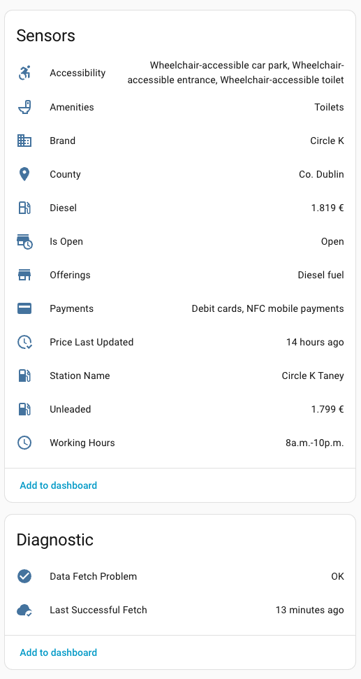

# Fuel Compare for Home Assistant

Track live unleaded and diesel prices from petrol stations directly in your Home Assistant dashboard.

## Features

- Live unleaded and diesel prices for any tracked station
- Timestamp sensor showing when prices were last updated
- Opening hours, full station name, brand, county, and facilities sensors per station
- `station_id` exposed on all entity attributes for easy use in automations
- Prices refresh automatically every 30 minutes
- Add as many stations as you like
- Easy setup — no YAML, no API keys, station name auto-fetched during setup
- Stale-retention on transient outages: entities keep their last known value when the site is offline or throttling, with a dedicated `data_fetch_problem` problem binary sensor and `last_successful_fetch` timestamp sensor for automations
- Provider abstraction layer: built to support additional data sources and countries in future releases
- Translated into 25 languages

## Setup

1. Install via HACS
2. Go to **Settings → Devices & Services → Add Integration**
3. Search for **Fuel Compare**
4. Enter the station ID from the station URL (e.g. `790`)
5. Confirm or customise the station name (auto-fetched from the site)
